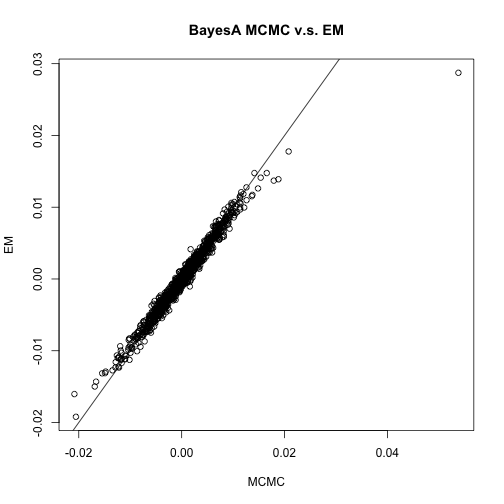
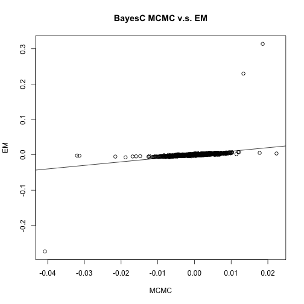
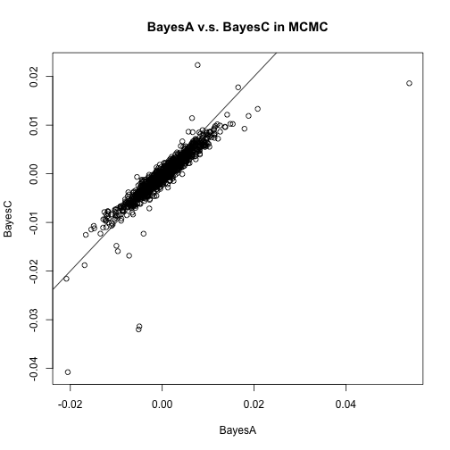
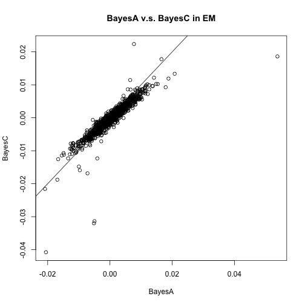

The package `BATools` is used to perform genome-wide association using a various Bayesian models. It is a implemented using both MCMC and EM algorithm.

The basic functions in `BATools` is `bafit`, which fits a genomic selection model using different prior selection. The main characteristic of this package are: 

- Fit model with different prior specification including the Antedependence model
- Flexibility to choose between MCMC and EM algorithm, both of which are able to estimate the hyperparameters
- Accepts `gpData` objects from package `synbreed` as input data. It can also use `numeric` and `matrix` as input 
- It is computationally efficient
- GWA using EM BayesA/C (under development)


## 1. Introduction
 
Whole genome prediction (WGP) is an evolutionary development in animal breeding. Currently, many models have been developed for WGP, which included rrBLUP, BayesA, BayesB, BayesC, Bayesian Lasso, Antedepedence BayesA/B (Meuwissen et al. 2001, VanRaden 2008, de los Campos et al. 2009, Habier et al. 2011, and Yang and Tempelman 2012). The major difference of these models are different prior assumptions on marker effects. Software packages like `BGLR` and `GenSel` implement BayesA, BayesB and Bayes Lasso model using MCMC algorithm. No public software is available to implement Antedependence models. At the same time, no R package is available for implement BayesA/C using EM algorithm for animal breeding. `BATools` package provides tools to fit Antedependence models in addition to some of the most popular models and provider faster EM algorithms to fit the model. The table below is a comparison between `BATools` and `BGLR`: 


Model/Algorithms | MCMC                   |  EM
---------------- |------------------------| --------------------
rrBLUP           | BATools/BGLR           |              BATools
BayesA           | BATools/BGLR           |              BATools
BayesB           | BATools/BGLR           |    under development
BayesC           | BATools/BGLR           |              BATools
Bayesian Lasso   | BATools/BGLR           |    under development 
AnteBayesA       | BATools                |    under development
AnteBayesB       | BATools                |    under development


## 2. Basic Model
The basic model used by `BATools` is:
$$
\boldsymbol{y} = \boldsymbol{X}\cdot \boldsymbol{b}+\boldsymbol{Z} \cdot \boldsymbol{g} + \boldsymbol{e},
$$
where:

- $\boldsymbol{y}$ is the vector of response variables
- $\boldsymbol{X}\cdot \boldsymbol{b}$ models the fixed effects
- $\boldsymbol{g}$ is the SNP marker effect and $\boldsymbol{Z}$ is corresponding genotype matrix of $n \cdot m$
- $\boldsymbol{e}$ are the vector of effects residual, $\boldsymbol{e} \sim N\left ( \boldsymbol{0},\boldsymbol{I}\sigma_{e}^{2}  \right )$

Notice that for different models, the priors on $\boldsymbol{g}_i$ are different:
- rrBLUP: $\boldsymbol{g}_j\sim N\left ( \boldsymbol{0},\boldsymbol{I}\sigma_{g}^{2}  \right )$
- BayesA: $\boldsymbol{g}_j\sim N\left ( \boldsymbol{0},\boldsymbol{D}\sigma_{g}^{2}  \right )$, where $\boldsymbol{D}=\{ \tau_1,\tau_2, ...,\tau_m \}$ and $\tau_j \sim \chi^{-2}\left( \nu_g,\nu_g \right)$

- BayesB: $\boldsymbol{g}_j\sim N\left ( \boldsymbol{0},\boldsymbol{D}\sigma_{g}^{2}  \right )$, where $\boldsymbol{D}=\{ \tau_1,\tau_2, ...,\tau_m \}$ and 
$$\tau_j=\{\begin{array}
{rrr}
0  & \mbox{with probability} & \pi \\
{\sim \chi^{-2}\left( \nu_g,\nu_g \right)} & \mbox{with probability} & 1-\pi
\end{array}$$

- BayesC: $\boldsymbol{g}_i\sim N\left ( \boldsymbol{0},\boldsymbol{D}\sigma_{g}^{2}  \right )$, where $\boldsymbol{D}=\{ \tau_1+\frac{1-\tau_1}{c},\tau_2+\frac{1-\tau_2}{c}, ...,\tau_m+\frac{1-\tau_m}{c}\}$ and $\tau_j\sim Bernoulli(\pi)$, $\tau_j=0,1$
- Bayesian Lasso: $\boldsymbol{g}_j\sim N\left ( \boldsymbol{0},\boldsymbol{D}\sigma_{g}^{2}  \right )$, where $\boldsymbol{D}=\{ \tau_1,\tau_2, ...,\tau_m \}$ and $\tau_j \sim Exp\left( \lambda^{2} \right)$

Furthermore, the Antedepedence models specify correlation structure for $\boldsymbol{g}$ based on the relative physical location of SNP markers along the chromosome : $$g_j=\{\begin{array}
{rrr}
\delta_j  & \mbox{if} & j=1 \\
t_{j,j-1}\delta_{j-1}+\delta_j & \mbox{if} & 2\leq j \leq m
\end{array}$$


## 3. BATools example

In `BATools`, we adhered the data structure of the object `gpData` in the `synbreed` package. The input and output objects are named as `baData` and `BAout`, which are R object class `list`. Therefore, users can directly use `synbreed` object as the input for `BATools`, and vice versa. More detailed explanation about `baData` and `BAout` can be found in the package manual file. 

##Example
We will use a toy dataset from the MSUPRP population to illustrate the use of `BATools`

###Load packages and data 

```r
library(BATools)
```

```
## Loading required package: msm
## Loading required package: synbreed
## Loading required package: doBy
## Loading required package: survival
## Loading required package: BLR
## Loading required package: SuppDists
## Package 'BLR', 1.4 (2014-12-03). 
## Type 'help(BLR)' for summary information
## Loading required package: regress
## Loading required package: abind
## Loading required package: coda
## Package 'BATools', 0.0.3 (2014-04-24), build 1. 
## Type 'help(BATools)' for summary information
```

```r
data("MSUPRP_sample")
summary(MSUPRP_sample)
```

```
## object of class 'gpData' 
## covar 
## 	 No. of individuals 253 
## 	         phenotyped 176 
## 	          genotyped 251 
## pheno 
## 	 No. of traits:		   3 
## 
##      ph_24h         temp_24h        driploss    
##  Min.   :5.190   Min.   :1.100   Min.   :0.000  
##  1st Qu.:5.450   1st Qu.:1.600   1st Qu.:0.560  
##  Median :5.540   Median :1.900   Median :0.940  
##  Mean   :5.552   Mean   :1.983   Mean   :1.141  
##  3rd Qu.:5.640   3rd Qu.:2.300   3rd Qu.:1.545  
##  Max.   :6.350   Max.   :3.400   Max.   :4.330  
##  NA's   :35      NA's   :18      NA's   :18     
## 
## geno 
## 	 No. of markers 20597 
## 	 genotypes 0 1 2 
## 	 frequencies 0.287 0.404 0.308 
## 	 NA's 0.000 %
## map 
## 	 No. of mapped markers  20597 
## 	 No. of chromosomes     18 
## 
## 	 markers per chromosome 
## 	
##    1    2    3    4    5    6    7    8    9   10   11   12   13   14   15 
## 1968 1419 1261 1559 1076 1143 1289  939 1426  958  936  833 1319 1263 1079 
##   16   17   18 
##  972  739  418 
## 
## pedigree 
## Number of 
## 	 individuals  253 
## 	 males :  98 , females :  155 
## 	 Par 1 (sire)  10 
## 	 Par 2 (dam)   44 
## 	 generations  3
```

Then we can create the data object used in `BATools` by `create.baData`. In this example we treat the sex as fixed effects

```r
pheno<-data.frame(MSUPRP_sample$pheno[,,]) 
geno<-MSUPRP_sample$geno[,1:500]
ped<-MSUPRP_sample$pedigree
map=MSUPRP_sample$map
sex<-ped$sex
sex<-as.factor(sex)
x<-model.matrix( ~ sex -1,contrasts.arg=list(sex=contrasts(sex, contrasts=F)))
colnames(x)<-c("female","male")
rownames(x)<-ped$ID
pig=create.baData(pheno=pheno,geno=geno,map=map,pedigree=ped,fixed=x,makeAinv=F)
```

###Set up initial values for the model
We choose to demonstrate how to fit BayesA using MCMC and EM. We start with MCMC:

```r
init=list(df=5,scale=0.01,pi=1)
run_para=list(niter=50000,burnIn=25000,skip=10)
print_mcmc=list(piter=5000)
update_para=list(df=FALSE,scale=TRUE,pi=FALSE)
op<-create.options(model="BayesA",method="MCMC",ante=FALSE,priors=NULL,init=init,
  update_para=update_para,run_para=run_para,save.at="BayesA",cv=NULL,print_mcmc=print_mcmc)
```

###Fit the model
We then fit the model using MCMC for the trait `driploss` with the above setups:

```r
ba<-bafit(dataobj=pig,op=op,trait="driploss")
```

```
## iter=  5000  vare=  0.398566 scale=  0.00105204 timepercycle=  0 estimated time left= 17.05 
## iter=  10000  vare=  0.463867 scale=  0.0003276 timepercycle=  0 estimated time left= 15.4 
## iter=  15000  vare=  0.385029 scale=  0.00031513 timepercycle=  0 estimated time left= 13.66 
## iter=  20000  vare=  0.522063 scale=  0.00038917 timepercycle=  0 estimated time left= 11.77 
## iter=  25000  vare=  0.475752 scale=  0.00023557 timepercycle=  0 estimated time left= 9.81 
## iter=  30000  vare=  0.41755 scale=  0.00031678 timepercycle=  0 estimated time left= 7.94 
## iter=  35000  vare=  0.437284 scale=  0.00058263 timepercycle=  0 estimated time left= 6.01 
## iter=  40000  vare=  0.544676 scale=  0.00072504 timepercycle=  0 estimated time left= 4.03 
## iter=  45000  vare=  0.472078 scale=  0.00100352 timepercycle=  0 estimated time left= 2.03 
## iter=  50000  vare=  0.512905 scale=  0.00051462 timepercycle=  0 estimated time left= 0
```

```r
ba
```

```
## BATools analysis of trait: driploss 
## 
## estimated fixed effects:
##   female     male 
## 1.167856 1.062502 
## 
## estimated hyperparameters:
##         vare         varg 
## 0.5218771950 0.0004800222 
## 
## effective sample size for hyperparameters: 
##      vare      varg 
## 1812.3013   95.7466
```

###Graphics


We can obtain the traceplot for MCMC:

```r
par(mar=c(2,2,2,2))
baplot(dataobj=pig,BAout=ba,type="trace",op=op)
```

 

###EM algorithm
To use the EM algorithm in `BATools`, we first run an analysis using rrBLUP:

```r
##################run rrBLUP REML#####################
init=list(df=NULL,scale=NULL,vare=NULL)
run_para=list(maxiter=100)
update_para=list(df=FALSE,scale=TRUE)
op<-create.options(model="rrBLUP",method="EM",ante=FALSE,priors=NULL,init=init,
    update_para=update_para,run_para=run_para,save.at="rrBLUP",cv=NULL,print_mcmc=NULL,convcrit=1E-4)

rr<-bafit(dataobj=pig,op=op,trait="driploss")
```

```
## rrBLUP iter= 1 
## Residual Variance is 0.4839849 Genetic Variance is 0.001855619
## rrBLUP iter= 2 
## Residual Variance is 0.4699503 Genetic Variance is 0.0009278096
## rrBLUP iter= 3 
## Residual Variance is 0.4511434 Genetic Variance is 0.000413168
## rrBLUP iter= 4 
## Residual Variance is 0.4477918 Genetic Variance is 0.000596557
## rrBLUP iter= 5 
## Residual Variance is 0.4484596 Genetic Variance is 0.0006125085
## rrBLUP iter= 6 
## Residual Variance is 0.4485716 Genetic Variance is 0.0006098466
## rrBLUP iter= 7 
## Residual Variance is 0.4485506 Genetic Variance is 0.0006103478
## rrBLUP iter= 8 
## Residual Variance is 0.4485546 Genetic Variance is 0.0006102548
## rrBLUP iter= 9 
## Residual Variance is 0.4485538 Genetic Variance is 0.0006102721
## rrBLUP iter= 10 
## Residual Variance is 0.448554 Genetic Variance is 0.0006102689
## 
## rrBLUP converged after 10 iterations and the convergence critira is 3.041205e-07
```

```r
rr
```

```
## BATools analysis of trait: driploss 
## 
## estimated fixed effects:
##   female     male 
## 1.147724 1.075463 
## 
## estimated hyperparameters:
##         vare         varg 
## 0.4485539606 0.0006102689
```
Then we use rrBLUP results as starting values for EM BayesA:

```r
df_i=5
scale_i=(df_i-2)/df_i*rr$hyper_est[2]
init=list(df=df_i,scale=scale_i,vare=rr$hyper_est[1],g=rr$ghat,b=rr$betahat,pi=1)
run_para=list(maxiter=100)
update_para=list(df=FALSE,scale=TRUE,pi=FALSE)
op<-create.options(model="BayesA",method="EM",ante=FALSE,priors=NULL,init=init,D="V",
    update_para=update_para,run_para=run_para,save.at="BayesA",cv=NULL,print_mcmc=NULL)
ba_em<-bafit(dataobj=pig,op=op,trait="driploss")
```

```
## BayesA EM iter= 1 
## Residual Variance is 0.4464904 Genetic Variance is 0.0006516123
## BayesA EM iter= 2 
## Residual Variance is 0.4477307 Genetic Variance is 0.0007392503
## BayesA EM iter= 3 
## Residual Variance is 0.4478413 Genetic Variance is 0.0007317113
## BayesA EM iter= 4 
## Residual Variance is 0.4475912 Genetic Variance is 0.0007342808
## BayesA EM iter= 5 
## Residual Variance is 0.447605 Genetic Variance is 0.0007339112
## BayesA EM iter= 6 
## Residual Variance is 0.4475951 Genetic Variance is 0.0007340262
## BayesA EM iter= 7 
## Residual Variance is 0.4475959 Genetic Variance is 0.0007340081
## BayesA EM iter= 8 
## Residual Variance is 0.4475955 Genetic Variance is 0.0007340134
## 
## BayesA converged after 8 iterations and the convergence critira is 9.617804e-07
```

```r
ba_em
```

```
## BATools analysis of trait: driploss 
## 
## estimated fixed effects:
##   female     male 
## 1.149234 1.077246 
## 
## estimated hyperparameters:
##         vare         varg 
## 0.4475954851 0.0007340134
```
###Graphics
Let's look at the estimated phenotypes v.s. true phenotypes for EM:

We can also compare the difference bewteen MCMC and EM:

```r
plot(ba$ghat,ba_em$ghat,xlab="MCMC",ylab="EM",main="BayesA MCMC v.s. EM")
abline(a=0,b=1)
```

 

###BayesC
Running BayesC is similar to running BayesA:

```r
init=list(df=5,scale=0.2,pi=0.1,c=1000)
run_para=list(niter=2000,burnIn=1000,skip=1)
print_mcmc=list(piter=200)
update_para=list(df=F,scale=T,pi=T)
priors=list(shape_scale=5,rate_scale=0.1,alphapi=1,betapi=9)
op<-create.options(model="BayesC",method="MCMC",
ante=FALSE,priors=NULL,init=init,update_para=update_para,
run_para=run_para,save.at="BayesCC",cv=NULL,print_mcmc=print_mcmc)
bc<-bafit(dataobj=pig,op=op,trait="driploss")
```

```
## iter=  200  vare=  0.486405 scale=  0.10400771 timepercycle=  0 estimated time left= 0.84 
## iter=  400  vare=  0.431683 scale=  0.01256922 timepercycle=  0 estimated time left= 0.73 
## iter=  600  vare=  0.497594 scale=  0.01288561 timepercycle=  0 estimated time left= 0.62 
## iter=  800  vare=  0.441814 scale=  0.01016238 timepercycle=  0 estimated time left= 0.53 
## iter=  1000  vare=  0.471487 scale=  0.00473627 timepercycle=  0 estimated time left= 0.44 
## iter=  1200  vare=  0.503146 scale=  0.00428124 timepercycle=  0 estimated time left= 0.36 
## iter=  1400  vare=  0.559778 scale=  0.00144218 timepercycle=  0 estimated time left= 0.27 
## iter=  1600  vare=  0.365421 scale=  0.00490985 timepercycle=  0 estimated time left= 0.18 
## iter=  1800  vare=  0.402956 scale=  0.00761927 timepercycle=  0 estimated time left= 0.09 
## iter=  2000  vare=  0.480923 scale=  0.00652987 timepercycle=  0 estimated time left= 0
```

```r
bc
```

```
## BATools analysis of trait: driploss 
## 
## estimated fixed effects:
##    female      male 
## 1.0006318 0.9363722 
## 
## estimated hyperparameters:
##        vare        varg          pi 
## 0.450900299 0.005179001 0.242778069 
## 
## effective sample size for hyperparameters: 
##       vare       varg         pi 
## 211.161947  13.812218   2.458483
```

```r
scale_i=rr$hyper_est[2]/(1/1000*rr$hyper_est[2]*(1-bc$hyper_est[3])+bc$hyper_est[3]*rr$hyper_est[2])
init=list(df=5,scale=scale_i,vare=rr$hyper_est[1],g=rr$ghat,b=rr$betahat,pi=bc$hyper_est[3],c=1000)
run_para=list(maxiter=100)
update_para=list(df=FALSE,scale=TRUE,pi=T)
op<-create.options(model="BayesC",method="EM",ante=FALSE,priors=NULL,init=init,
    update_para=update_para,run_para=run_para,save.at="BayesC",cv=NULL,print_mcmc=NULL,convcrit=1E-4)
bc_em<-bafit(dataobj=pig,op=op,trait="driploss")
```

```
## BayesC EM iter= 1 
## Residual Variance is 0.5189831 Genetic Variance is 2.053091 pi is 0.009901201
## BayesC EM iter= 2 
## Residual Variance is 0.4681158 Genetic Variance is 1.026545 pi is 0.000324081
## BayesC EM iter= 3 
## Residual Variance is 0.4529967 Genetic Variance is 0.305767 pi is 1.039069e-05
## BayesC EM iter= 4 
## Residual Variance is 0.4480365 Genetic Variance is 0.5457502 pi is 3.414867e-07
## BayesC EM iter= 5 
## Residual Variance is 0.4481474 Genetic Variance is 0.6167073 pi is 1.071567e-08
## BayesC EM iter= 6 
## Residual Variance is 0.4486061 Genetic Variance is 0.6090187 pi is 3.381243e-10
## BayesC EM iter= 7 
## Residual Variance is 0.4485441 Genetic Variance is 0.6105003 pi is 1.069146e-11
## BayesC EM iter= 8 
## Residual Variance is 0.4485558 Genetic Variance is 0.6102263 pi is 3.379746e-13
## BayesC EM iter= 9 
## Residual Variance is 0.4485536 Genetic Variance is 0.6102774 pi is 1.068437e-14
## BayesC EM iter= 10 
## Residual Variance is 0.448554 Genetic Variance is 0.6102679 pi is 3.37875e-16
## BayesC EM iter= 11 
## Residual Variance is 0.4485539 Genetic Variance is 0.6102697 pi is 1.04903e-17
## BayesC EM iter= 12 
## Residual Variance is 0.4485539 Genetic Variance is 0.6102693 pi is 4.370957e-19
## 
## BayesC converged after 12 iterations and the convergence critira is 4.35124e-07
```

```r
bc_em
```

```
## BATools analysis of trait: driploss 
## 
## estimated fixed effects:
##   female     male 
## 1.147724 1.075463 
## 
## estimated hyperparameters:
##         vare         varg           pi 
## 4.485539e-01 6.102693e-01 4.370957e-19
```

We can also compare the difference bewteen MCMC and EM for BayesC:

```r
plot(bc$ghat,bc_em$ghat,xlab="MCMC",ylab="EM",main="BayesC MCMC v.s. EM")
abline(a=0,b=1)
```

 

We can also compare the difference bewteen BayesA and BayesC for MCMC:

```r
plot(ba$ghat,bc$ghat,xlab="BayesA",ylab="BayesC",main="BayesA v.s. BayesC in MCMC")
abline(a=0,b=1)
```

 

We can also compare the difference bewteen BayesA and BayesC for EM:

```r
plot(ba$ghat,bc$ghat,xlab="BayesA",ylab="BayesC",main="BayesA v.s. BayesC in EM")
abline(a=0,b=1)
```

 
